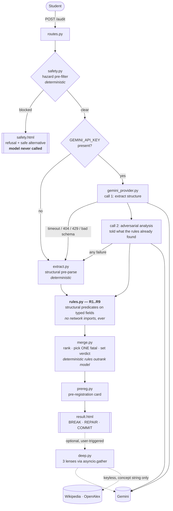

# CounterLab — architecture

## Request path

The dashed box is severable. The solid path from `extract.py` through `merge.py` has no external dependency at all.

## Who decides what

| Decision | Deterministic | Model |
|---|:---:|:---:|
| Is the plan unsafe enough to refuse? | ✅ `safety.py` | adds context only |
| Pulling variables/units/trials out of prose | fallback only | ✅ |
| `len(variables_changed) > 1` → confounded | ✅ `R1` | |
| Missing outcome / missing IV / self-contradiction | ✅ `R2 R3 R8` | |
| Missing unit / too few trials / no control / no method | ✅ `R4 R5 R6 R7 R9` | |
| **Which single flaw is fatal** | ✅ `merge.pick_fatal` | |
| **The verdict** | ✅ `merge.build_response` | |
| Repairs and falsification test | template fallback | ✅ preferred |
| Nuance the predicates can't reach | | ✅ |

Every finding rendered in the UI carries its `source` as a visible chip.

## Why the injection defence holds

The verdict is a return value of `merge.build_response()`, computed from `ExperimentAudit`'s typed fields plus `run_rules()`. The model contributes *findings*, which can only ever be **added** to the list — it has no path to the verdict, to `pick_fatal`'s priority order, or to any deterministic rule's output.

So the interesting test isn't "does the model resist the injection". It's `test_verdict_holds_even_if_the_model_is_fully_compromised` — a provider that returns *no problems at all* still yields `verdict == "fatal_flaw"` with `source == "deterministic"`.

Layered on top, in order of how much they actually matter:

1. Verdict computed from typed fields (structural — this is the one that works)
2. `responseSchema` constrains output to declared fields (no free-text channel)
3. Student text delimited as `<student_submission>` data, never in the system role
4. `</student_submission>` forgery stripped by `_sanitise()`
5. Model instructed that the content is data; injection attempts noted in `assumptions`
6. Detected attempts surfaced to the student rather than hidden

## Failure behaviour

| Failure | Result |
|---|---|
| No API key | Rules-only, banner shown, `/healthz` reports `rules-only` |
| Model timeout (20 s) | Rules-only |
| Model 404 (retired model) | Next model in `MODEL_FALLBACK_CHAIN` |
| Model 429 (free-tier throttle) | Next model, then rules-only |
| Schema validation failure | Rules-only |
| Junk field values | Coerced and clamped, request continues |
| Wikipedia down | OpenAlex; then cards omitted silently |
| Deep Audit fails | Reports *N of 3 passes did not complete*; instant result untouched |
| Anything unhandled | Global handler → rules-only result, never a 500 from `/audit` |

`/audit` returning 5xx is treated as a bug and is asserted against for every fixture.

## Deployment

Single free Render web service, `uvicorn app.main:app`. No database, no auth, no session store, no build step.

Python is pinned to 3.12.3 via **both** `PYTHON_VERSION` and `.python-version` — Render builds on 3.14 by default and ignores `runtime.txt`, which leaves `pydantic-core` with no wheel and a Rust build against a read-only cargo directory.

`render.yaml` declares the web service only. Render Workflows are not Blueprint-compatible, and in any case creating one returned HTTP 402 (payment required), so none is deployed. See the README for what that means for the prize track.
